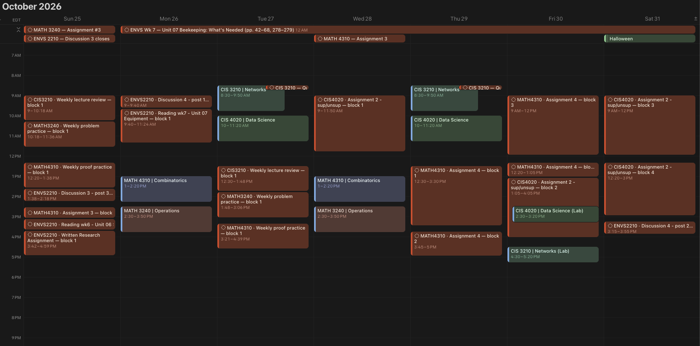

# school-scheduler

A deterministic term planner. It time-blocks every reading, assignment, discussion post
and exam prep session around your Google Calendar, puts the blocks in a Notion database
(which Notion Calendar shows), and replans on its own when your week changes. No LLM calls.

## What it does

- **Plans the term.** `plan.py` places each task's estimated time before its deadline,
  inside your work hours, around classes, meals, travel and anything Busy on your calendar.
  Hand-ins finish 3 days early; sessions are capped at 3 h, with breaks.
- **Checks itself.** `verify.py` fails the plan if any rule is broken, so a bad plan never
  replaces a good one.
- **Tracks progress in Notion.** Every block is a row. Ticking a block records the time
  spent (its size on the calendar is its time); ticking your own deadline row hands the
  task in. Drag a block to lock it there; resize it to change its length.
- **Replans around change.** A new calendar event, a missed block or a finished task
  reflows everything after now.
- **Learns your pace.** Measured time on finished tasks recalibrates the estimates for
  similar work (`learn.py`).

## Layout

| File | Role |
|---|---|
| `service.py` | One run: `poll` (replan if anything changed) or `sweep` (the daily full pass) |
| `plan.py`, `verify.py` | The planner and its rule checker |
| `notion.py`, `notion_sync.py`, `notion_map.py` | Notion client and row sync |
| `gcal.py` | Google free/busy and the warnings calendar |
| `learn.py` | Learned pace multipliers |
| `deploy/` | systemd units and timers, and `install.sh` |
| `PRD-autoplanner.md` | Design notes |

## How it runs

Two systemd user timers run the same script:

| Timer | Runs | Does |
|---|---|---|
| `f26-planner-poll.timer` | every minute | `service.py poll`: reads Notion and free/busy, replans only if something changed |
| `f26-planner-sweep.timer` | 00:05 Toronto, daily (catches up after downtime) | `service.py sweep`: turns the day over, adopts new deliverable rows, replans anyway, rewrites every block row, refreshes the stats page |

A lock file keeps the two from overlapping. Install with `deploy/install.sh` on the host;
`uv run service.py poll --dry-run` plans and diffs without writing.

## Setup

Your inputs stay out of git (see `.gitignore`): `config.yaml` (term, classes, work hours),
`tasks.yaml` (deliverables and estimates), `events.yaml`, `gcal.json`. Secrets live on the
host at `~/.config/f26-planner/` with mode 600: a Notion connection token and a Google
service-account key. See [TODO.md](TODO.md) for what is in progress.
